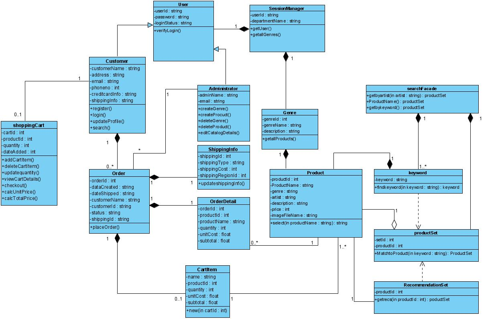
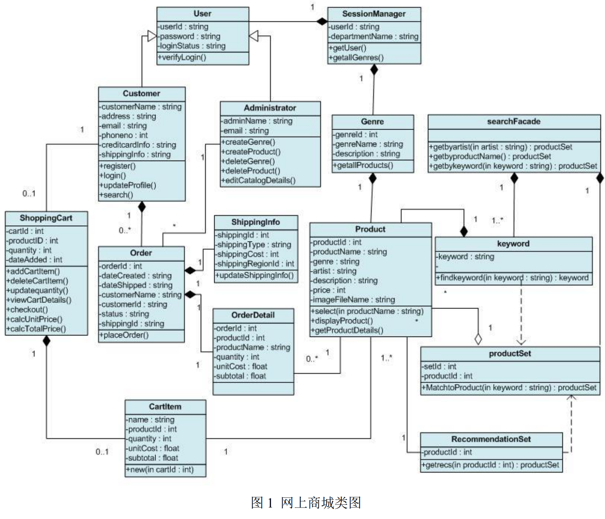
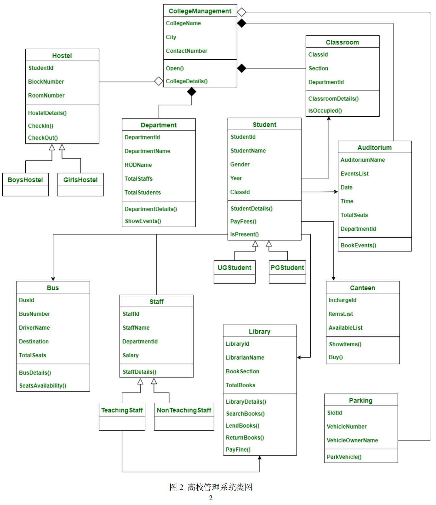

### 1.网上商城类图

---

### 2. ATM系统类图

---

### 3. 类图自动转换为实体关系图

---

3.1.1

E-R图

3.1.2

C++/Java源代码

---

3.2.1

E-R图

3.2.2

C++/Java源代码

### 4 Redis分析

软件框架结构

算法解析 （如：FreeNOS/FreeRTOS 的任务调度算法、Redis 的 LRU 与 LFU 算法）原理

### 5. 类图解释

