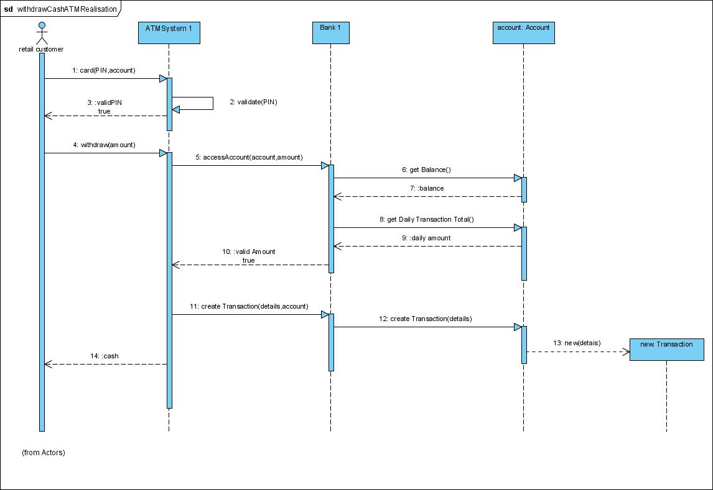
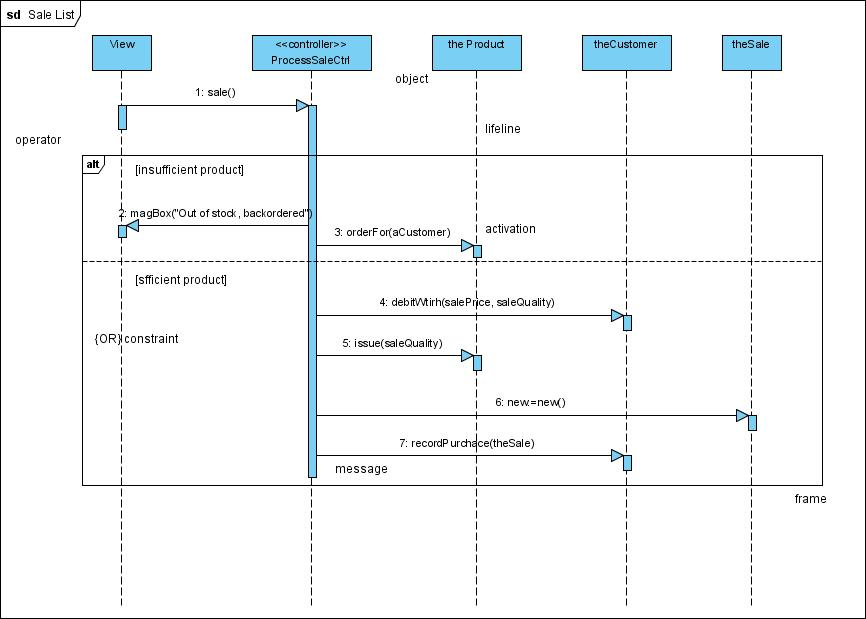
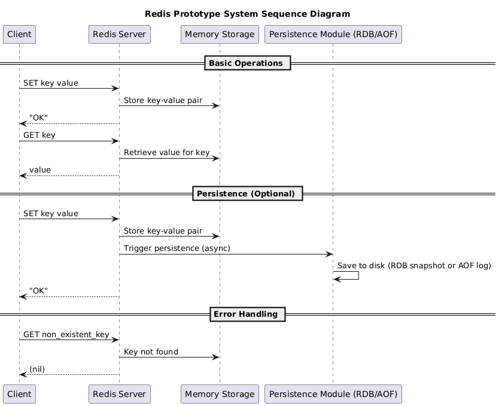
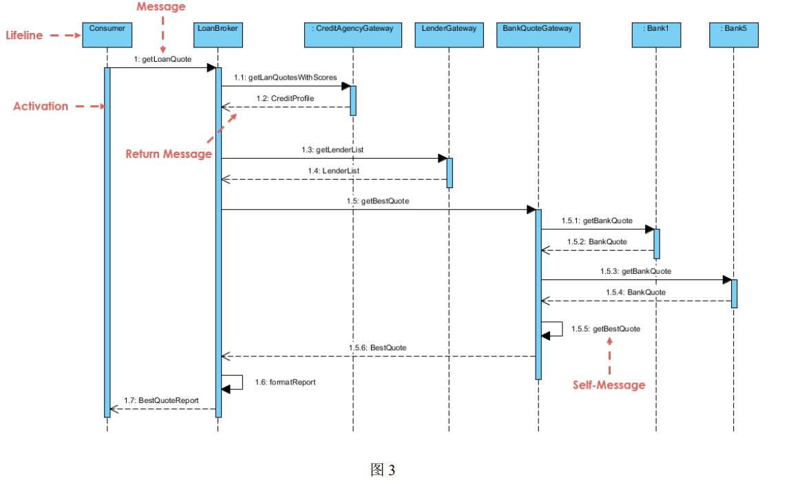
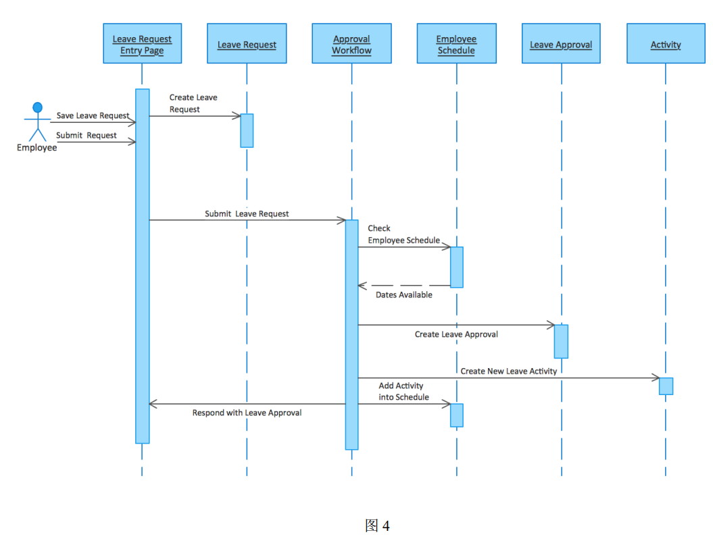

# 1. 序列图

好玩的网站：https://plantuml.com/zh/，可以根据文本生成UML图，适用于基于AI快速搭建再根据用户需求进行优化的快速迭代场景

# 2. 序列图解释

> ## **1. 序列图的目的**
>
> 该序列图展示了一个**贷款中介系统**（Loan Broker）在处理消费者贷款请求的过程中，如何与多个外部系统交互（如信用评分、贷款银行等）以获取最佳贷款报价。
>
> **涉及的参与者：**
>
> - **Consumer（消费者）**：贷款请求的发起者。
> - **LoanBroker（贷款中介）**：协调整个贷款报价流程的核心逻辑模块。
> - **CreditAgencyGateway**：信用评分系统的接口，用于获取消费者信用信息。
> - **LenderGateway**：贷款方网关，负责提供支持贷款服务的银行列表。
> - **BankQuoteGateway**：银行报价网关，负责向各银行发送报价请求并选择最佳报价。
> - **Bank1 与 Bank5**：实际的贷款银行，响应报价请求。
>
> **核心交互流程：**
>  消费者提交贷款申请后，系统依次获取信用信息、贷款银行列表，向多家银行请求报价，最后选出最优报价并返回结果。
>
> ------
>
> ## **2. 图中关键元素**
>
> ### **(1) 参与者（Actors/Objects）**
>
> - **Consumer**：业务发起人，触发整个贷款流程。
> - **LoanBroker**：业务协调者，负责调用各子系统。
> - **CreditAgencyGateway**：负责返回消费者的信用评分。
> - **LenderGateway**：返回当前支持的贷款银行列表。
> - **BankQuoteGateway**：向各银行请求报价，并从中选出最优报价。
> - **Bank1、Bank5**：报价的实际银行系统。
>
> ### **(2) 生命线（Lifelines）**
>
> - 每个参与者下面的竖线表示其在整个过程中“活跃”的时间段。
> - 蓝色的长条（Activation）表示该对象正在处理某个消息。
>
> ### **(3) 消息（Messages）**
>
> - **同步调用（实线箭头）**：
>   - 如 `getLoanQuote`、`getLenderList`，表示调用方会等待对方完成后继续执行。
> - **返回消息（虚线箭头）**：
>   - 如 `CreditProfile`、`BankQuote`，表示方法执行完毕后的结果返回。
> - **自消息（Self-Message）**：
>   - 如 `BankQuoteGateway` 的 `getBestQuote` 调用自身方法，用于内部逻辑处理。
>
> ------
>
> ## **3. 交互流程解读**
>
> 1. **消费者提交贷款请求**
>    - `Consumer → LoanBroker`：调用 `getLoanQuote()` 发起贷款报价请求。
> 2. **获取信用评分**
>    - `LoanBroker → CreditAgencyGateway`：调用 `getLoanQuotesWithScores()`。
>    - `CreditAgencyGateway → LoanBroker`：返回 `CreditProfile`（信用评分）。
> 3. **获取贷款银行列表**
>    - `LoanBroker → LenderGateway`：调用 `getLenderList()`。
>    - `LenderGateway → LoanBroker`：返回 `LenderList`（贷款银行列表）。
> 4. **获取银行报价**
>    - `LoanBroker → BankQuoteGateway`：调用 `getBestQuote()`。
>      - `BankQuoteGateway → Bank1`：调用 `getBankQuote()`。
>      - `Bank1 → BankQuoteGateway`：返回 `BankQuote`。
>      - `BankQuoteGateway → Bank5`：调用 `getBankQuote()`。
>      - `Bank5 → BankQuoteGateway`：返回 `BankQuote`。
>      - `BankQuoteGateway → self`：调用 `getBestQuote()` 从多个报价中筛选出最佳。
> 5. **汇总并返回最佳报价报告**
>    - `BankQuoteGateway → LoanBroker`：返回 `BestQuote`。
>    - `LoanBroker` 调用 `formatReport()` 格式化结果。
>    - `LoanBroker → Consumer`：返回最终的 `BestQuoteReport`。
>
> ------
>
> ### **扩展思考：**
>
> - **性能优化**：对多银行请求可改为并发异步处理，提升响应速度。
> - **容错能力**：增加超时与重试机制，提高系统鲁棒性。
> - **扩展性**：银行网关可支持更多银行节点，实现动态扩展。
> - **一致性保障**：若返回结果影响资金流程，需增加事务管理或补偿机制。

> ## **1. 序列图的目的**
>
> 本序列图用于描述员工发起请假请求后，系统如何处理该请求的流程。它涵盖了从提交申请、检查排班、审批请假到更新员工日程等一系列交互过程。
>
> ### **涉及的参与者：**
>
> - **Employee（员工）**：发起请假流程。
> - **Leave Request Entry Page**：请假申请界面，提供交互入口。
> - **Leave Request**：处理请假请求的数据实体。
> - **Approval Workflow**：请假审批工作流模块。
> - **Employee Schedule**：员工排班系统，用于判断请假日期是否可用。
> - **Leave Approval**：处理请假批准操作。
> - **Activity**：员工日程安排中的活动信息。
>
> ### **核心交互流程：**
>
> 员工填写并提交请假申请后，系统验证可用时间，审批请假并更新员工排班信息，最终返回处理结果。
>
> ------
>
> ## **2. 图中关键元素**
>
> ### **(1) 参与者（Actors/Objects）**
>
> - **Employee**：业务发起人，手动填写和提交请假请求。
> - **Leave Request Entry Page**：用于用户操作和数据录入的界面层。
> - **Leave Request**：处理并封装请假数据。
> - **Approval Workflow**：接收请假请求并推动审批逻辑。
> - **Employee Schedule**：验证员工在特定时间段内是否有空。
> - **Leave Approval**：负责记录批准的请假信息。
> - **Activity**：员工请假被批准后，作为一项新活动写入日程。
>
> ### **(2) 生命线（Lifelines）**
>
> - 每条虚线表示对象在系统生命周期内的存在。
> - 蓝色长方形激活条表示该对象在该时间段内正在处理操作。
>
> ### **(3) 消息（Messages）**
>
> - **同步消息（实线箭头）**：
>   - 如 `Save Leave Request`、`Create Leave Request`、`Check Employee Schedule` 表示调用后需等待响应。
> - **返回消息（虚线箭头）**：
>   - 如 `Dates Available` 表示返回检查结果。
> - **无异步消息或组合片段**（如条件、循环等）出现在该图中。
>
> ------
>
> ## **3. 交互流程**
>
> 1. **员工填写请假单**
>    - `Employee → Leave Request Entry Page`：执行 `Save Leave Request` 和 `Submit Request`。
> 2. **系统创建请假数据**
>    - `Leave Request Entry Page → Leave Request`：调用 `Create Leave Request`。
> 3. **提交请假申请进入审批流程**
>    - `Leave Request Entry Page → Approval Workflow`：提交 `Submit Leave Request`。
> 4. **检查员工排班表**
>    - `Approval Workflow → Employee Schedule`：调用 `Check Employee Schedule`。
>    - `Employee Schedule → Approval Workflow`：返回 `Dates Available`。
> 5. **创建请假批准记录**
>    - `Approval Workflow → Leave Approval`：调用 `Create Leave Approval`。
> 6. **将请假写入员工日程安排中**
>    - `Leave Approval → Activity`：调用 `Create New Leave Activity`。
>    - `Activity → Employee Schedule`：调用 `Add Activity into Schedule`。
> 7. **流程结束，系统返回审批结果**
>    - `Approval Workflow → Leave Request Entry Page`：返回 `Respond with Leave Approval`。
>
> ------
>
> ### **扩展思考：**
>
> - **业务优化**：可引入异步通知机制，将请假结果通过邮件或消息推送至员工。
> - **异常处理增强**：加入时间冲突检测与人工干预机制，提高审批准确性。
> - **流程拓展性**：支持多级审批人配置，满足更复杂的组织架构